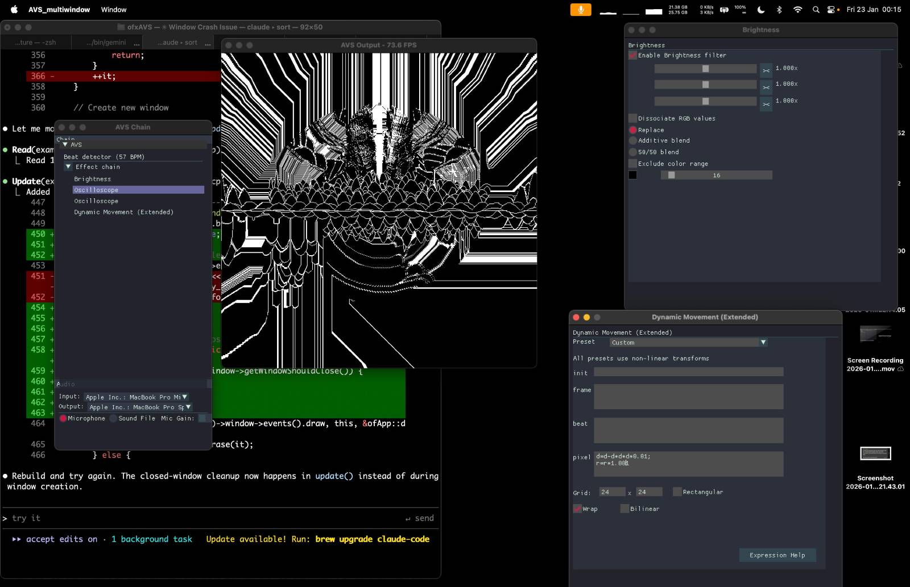

# ofxAVS

OpenFrameworks addon for AVS (Advanced Visualization Studio) - bringing Nullsoft's legendary Winamp visualizer to creative coding.

## What is AVS?

Advanced Visualization Studio was the iconic music visualization plugin for Winamp, created by Justin Frankel in the late 1990s. It featured modular effect chains, real-time audio reactivity, and a scripting engine that spawned thousands of community-created presets.

This project is a modern C++ port that maintains compatibility with original AVS presets while bringing the visualizer to macOS and creative coding platforms.

## Features

- **49 effects ported** from the original AVS
- **Full preset compatibility** - Load original .avs preset files
- **Built-in audio management** - Microphone input or audio file playback with device selection
- **ImGui-based UI** - Effect chain editing with parameter controls
- **Beat detection** - Automatic BPM detection and beat-triggered effects
- **Session persistence** - Effect chains and audio settings saved/restored between sessions
- **Auto-resizing output** - Renders at native resolution, ideal for fullscreen
- **Effect profiling** - Press P to show per-effect render times

## Screenshots



The addon provides a complete visualization environment:
- Effect chain panel with drag-drop reordering
- Parameter controls matching original AVS dialogs
- Audio controls with device selection and file playback
- Auto-resizing output (renders at native resolution)

## Quick Start

### Prerequisites

- OpenFrameworks 0.12+ (https://github.com/openframeworks/openFrameworks/blob/master/INSTALL_FROM_GITHUB.md)
- C++17 compiler
- Required addons:
  - [ofxImGui](https://github.com/jvcleave/ofxImGui) - UI rendering
  - [ofxFft](https://github.com/kylemcdonald/ofxFft) - FFT audio processing
  - [ofxAudioDecoder](https://github.com/kylemcdonald/ofxAudioDecoder) - Audio file playback

### Building

```bash
# first install openFrameworks and required addons

# Set OpenFrameworks path
export OF_ROOT=/path/to/openFrameworks

# Clone into addons directory
cd $OF_ROOT/addons
git clone --recursive ssh://git@git.eclectronics.org:2222/timredfern/ofxAVS.git

# Build the standard example
cd ofxAVS/examples/AVS_standard
make
make RunRelease
```

or, just install a release

### Usage

```cpp
#include "ofxAVS.h"
#include "ofxImGui.h"

class ofApp : public ofBaseApp {
    ofxAVS avs;
    ofxImGui::Gui gui;

    void setup() {
        gui.setup();
        avs.setup();
        avs.loadAudioSettings();  // Restore saved audio device selection
        avs.setupAudio();         // Initialize audio input/output
    }

    void update() {
        avs.update();
    }

    void draw() {
        avs.draw(0, 0, 600, 600);  // Auto-resizes to fit

        gui.begin();
        avs.drawUI();       // Effect chain + parameter panels
        avs.drawAudioUI();  // Audio device selection + file player
        gui.end();
    }
};
```

## Project Structure

```
ofxAVS/
├── src/                    # OpenFrameworks addon layer
│   ├── ofxAVS.cpp/h        # Main addon: rendering, audio, UI
│   └── AVSui.cpp/h         # ImGui control rendering
├── docs/                   # Documentation
│   ├── ARCHITECTURE.md     # ofxAVS architecture
│   ├── BUILD.md            # Build instructions
│   └── FYREWURX.md         # Fyrewurx preset notes
├── libs/avs_lib/           # Portable AVS library (no dependencies)
│   ├── core/               # Renderer, effects, parameters
│   ├── effects/            # 49 effect implementations
│   └── tests/              # Unit tests
├── examples/
│   ├── AVS_standard/       # Single-window example with full UI
│   ├── AVS_multiwindow/    # Separate output window for fullscreen
│   └── AVS_simple/         # Minimal integration example
├── images/                 # Screenshots for documentation
└── scripts/
    └── package-app.sh      # macOS app packaging
```

## Implemented Effects

### Rendering
Blur, Brightness, Bump, Channel Shift, Clear, Color Fade, Color Reduction, Fast Brightness, Grain, Invert, Mosaic, Interferences, Interleave, Mirror, Multiplier, Scatter, Shift, Unique Tone

### Transforms
Dynamic Movement, Movement, Rotoblitter

### Visualization
Dot Fountain, Dot Grid, Dot Plane, Oscilloscope, OscStar, Picture, Ring, RotStar, Starfield, Starfield Extended, SuperScope, Timescope, Moving Particle, Water

### Containers
Effect List, Effect List Root

### Timing
Custom BPM, Fadeout, OnBeat Clear, Set Render Mode

### Trans
Bass Spin, Blitter Feedback, DDM

## Examples

### AVS_standard
Single-window application with effect chain, parameters panel, and audio controls. Best for most use cases.

### AVS_multiwindow
Separate output window that can be made fullscreen independently. UI runs in a separate chain window. Renders at native resolution in fullscreen.

### AVS_simple
Minimal example showing basic integration without UI panels.

## Building & Packaging

```bash
cd examples/AVS_standard

# Available targets
make help

# Build and run
make Release
./bin/AVS_standard.app/Contents/MacOS/AVS_standard

# Package for distribution
make package          # Creates .app and .dmg
make app-info         # Show binary info (arch, min OS)
```

## Architecture

The addon is split into two layers:

**avs_lib** (`libs/avs_lib/`) - Portable C++ library with zero dependencies. Contains the renderer, effect implementations, preset loading, and parameter system. Can be used standalone without OpenFrameworks.

**ofxAVS** (`src/`) - OpenFrameworks integration layer. Handles texture rendering, ImGui UI, audio input, and session persistence.

See `libs/avs_lib/README.md` for detailed library documentation.

## Original Credits

- **Justin Frankel** - Creator of AVS and Winamp
- **Nullsoft** - Original AVS development and open-source release
- **AVS Community** - Decades of amazing presets

## License

MIT License - see LICENSE file

Based on original AVS source code by Nullsoft, Inc.
AVS Copyright (C) 2005 Nullsoft, Inc.
